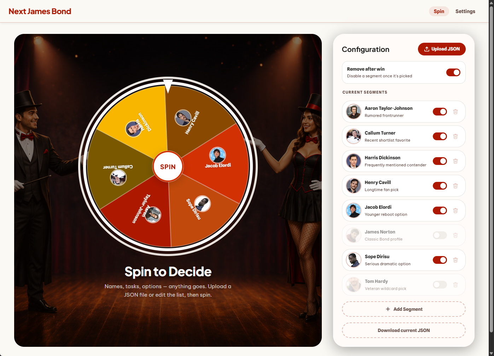

# Picker

Picker is a small React + Vite app for running a spin-the-wheel selection flow. You can load entries from JSON, add entries manually in the UI, assign weights and colors, persist the picker state locally, and pick a winner with an animated canvas wheel.



## What It Does

- Spins a weighted wheel and returns a winner in a modal
- Imports segments from a JSON file by upload or drag and drop
- Lets you add segments manually from the configuration panel
- Supports optional subtitle, emoji, image URL, custom color, and weight per segment
- Includes switchable wheel color themes
- Can automatically disable a winner after each spin
- Persists upload-compatible picker state in local storage
- Downloads the current picker state as reusable JSON
- Shows segments alphabetically in the configuration list
- Starts with a built-in sample list so the app is usable immediately

## Tech Stack

- React 19
- Vite 6
- CSS Modules
- Canvas rendering for the wheel

## Getting Started

### Requirements

- Node.js 18+ is the safe baseline for Vite 6

### Install

Using `npm`:

```bash
npm install
```

Using `yarn`:

```bash
yarn install
```

### Run Locally

```bash
npm run dev
```

or

```bash
yarn dev
```

Vite will print the local development URL in the terminal.

### Build

```bash
npm run build
```

or

```bash
yarn build
```

### Preview Production Build

```bash
npm run preview
```

## Run With Docker

Build and start the containerized app:

```bash
npm run docker:up
```

Stop it:

```bash
npm run docker:down
```

Tail container logs:

```bash
npm run docker:logs
```

The app will be available at `http://localhost:4173`.

## How To Use

1. Open the app and stay on the `Spin` page.
2. Load data by either:
   - uploading a JSON file,
   - dragging a JSON file into the page,
   - or adding segments manually.
3. Use `Download current JSON` to export the current picker state for later re-upload.
4. Optionally enable `Remove after win` if winners should be disabled after selection.
5. Open `Settings` to choose a wheel palette and spin speed.
6. Press `SPIN`.

## JSON Format

The preferred upload format is a root object with picker-level settings plus a `segments` array. Legacy plain arrays are still accepted and fall back to the default app settings.

### Root Fields

| Field | Type | Required | Notes |
| --- | --- | --- | --- |
| `picker_name` | string | No | Changes the name shown in the top-left app header |
| `remove_after_win` | boolean | No | Sets whether winners are disabled automatically after a spin |
| `spin_speed` | string | No | Must be `slow`, `normal`, or `fast` |
| `segments` | array | Yes for object uploads | List of segment objects |

### Supported Fields

| Field | Type | Required | Notes |
| --- | --- | --- | --- |
| `label` | string | Yes | Display name shown on the wheel and in the result modal |
| `subtitle` | string | No | Secondary line shown in the list and result modal |
| `icon` | string | No | Remote image URL shown on the wheel and in the result modal |
| `emoji` | string | No | Used when no image is provided |
| `color` | string | No | Hex or CSS color string; overrides the selected theme for that segment |
| `weight` | number | No | Relative probability; values `> 0` are used, otherwise the app falls back to `1` |
| `enabled` | boolean | No | Controls whether the segment starts enabled in the list and wheel |

### Example

```json
{
  "picker_name": "Team Picker",
  "remove_after_win": true,
  "spin_speed": "normal",
  "segments": [
    {
      "label": "Alice Chen",
      "subtitle": "Engineering",
      "icon": "https://i.pravatar.cc/150?img=1",
      "weight": 1,
      "enabled": true
    },
    {
      "label": "Bob Torres",
      "subtitle": "Product",
      "emoji": "📦",
      "color": "#0077b6",
      "weight": 2,
      "enabled": false
    }
  ]
}
```

## Current Import Behavior

- `label` is the only required field.
- Imported segments respect `enabled` when provided and default to enabled otherwise.
- Root-level picker settings are applied on upload when present.
- Downloaded JSON uses the same schema as uploaded JSON.
- If the JSON is invalid, or no valid segment array is found, the app shows an error banner.

## Persistence

- The app stores the same root-level state the upload JSON supports in `localStorage`:
  - `picker_name`
  - `remove_after_win`
  - `spin_speed`
  - `segments`
- If saved state exists, the app restores it on load.
- If no saved state exists, the app starts with the built-in defaults.

## Notes

- Remote avatar/image URLs should allow cross-origin loading, otherwise the wheel will render the segment without the image.
- Theme colors only fill missing segment colors. If a segment already has `color`, that value wins.
- The configuration list is sorted alphabetically by segment label.

## Example Files

- `examples/zdf.json`: team picker example with images
- `examples/food-picks.json`: food chooser example
- `examples/next-james-bond.json`: Bond casting example with `icon: null` placeholders for actor images

## Project Structure

```text
src/
  components/
    SegmentList.jsx
    Settings.jsx
    Wheel.jsx
    WinnerModal.jsx
  utils/
    defaultSegments.js
    parseSegments.js
    themes.js
  App.jsx
  main.jsx
```

## Scripts

- `npm run dev` / `yarn dev`: start the Vite dev server
- `npm run build` / `yarn build`: create a production build in `dist/`
- `npm run preview` / `yarn preview`: preview the production build locally
- `npm run docker:build`: build the Docker image with Docker Compose
- `npm run docker:up`: build and start the app container in the background
- `npm run docker:down`: stop and remove the app container
- `npm run docker:logs`: stream logs from the running app container
